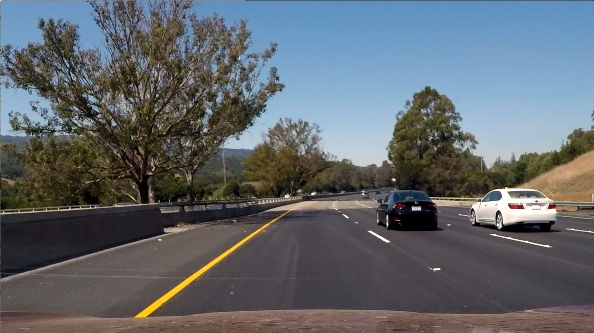

# Vehicle Detection
[](http://www.udacity.com/drive)

In this project, your goal is to write a software pipeline to detect vehicles in a video (start with the test_video.mp4 and later implement on full project_video.mp4), but the main output or product we want you to create is a detailed writeup of the project.  Check out the [writeup template](https://github.com/udacity/CarND-Vehicle-Detection/blob/master/writeup_template.md) for this project and use it as a starting point for creating your own writeup.


# General Approach

For this project I decided to use a deep learning based approach as opposed to the classic computer vision approach using HOG (Histogram of Oriented Gradients) in combination with a Linear SVM classifier. I chose to try a DL based solution out of personal interest as well as out of performance reasons. Using a classifier on HOG features is faster than passing an image through a deep CNN, but the need for a sliding window heavily slows down the whole process as each image then requires up to a hundred patches to be cropped and classified. The CNN approach requires the image to be only processed once.

## Choice of Neural Network

There are several neural network architectures, which have been developed to solve the task of detecting object boundaries in an image. Most prominently, R-CNN, Fast-R-CNN, Faster-R-CNN, YOLO and SSD are known to yield good results. Comparing the speed and accuracy of these networks quickly reveals that YOLO and SSD are the fastest options, with SSD taking the lead. Accuracy-wise SSD has high scores. SSD exists in two variants: SSD300 and SSD512. The numbers denote the pixel dimensions of the input images. While SSD512 has a slightly higher accuracy, SSD300 has shorter processing times per image and therefore results in a higher fps rate. Out of these considerations I chose to apply SSD300 for this project.


# Single Shot Multibox Detector (SSD)

The [SSD network](https://arxiv.org/abs/1512.02325) is based on a convolutional network structure. Typically, VGG-16 is used as base network, on top of which, instead of fully connected layers, more convolutional layers are stacked. Objects are detected by relying on features detected in various layers from the network. As illustrated below, the features from six layers are used for object detection.


## Implementation

The original SSD network was implemented using Caffe. There are also a Keras ports existing [here](https://github.com/rykov8/ssd_keras) and [here](https://github.com/oarriaga/single_shot_multibox_detector). I use the latter for this project as it supports Keras 2. The network implementation in this repository can be found [here](helpers/ssd.py).

## Training

Training the SSD300 network takes a considerable amount of time. As pre-trained weights for this network exist, I chose to use the weights available [here](https://github.com/oarriaga/single_shot_multibox_detector/blob/master/trained_models/weights_SSD300.hdf5). The weights were trained using the Pascal VOC dataset. They are included in this repository [here](weights_SSD300.hdf5) and loaded in [`main.py`](main.py#L32).

## Output

The SSD network outputs predictions in the form `[label, confidence, x_min, y_min, x_max, y_max]`. In order to only display relevant predictions, a [threshold is applied](helpers/utils.py#L62). A lower threshold will enable us to detect more objects, but also increase the potential for false positives. A higher threshold reduces the false positives, but increases the odds of not detecting a few objects.

I picked a threshold of [0.5](helpers/utils.py#L40). Furthermore, as we're only interested in detecting vehicles, I only draw objects belonging to the classes `'Car', 'Bus', 'Motorbike', 'Bicycle', 'Person'` (see [`helpers/utils.py`, line 88](helpers/utils.py#L88)).

## Non-Maximum Suppression

Naturally, the network returns multiple hits per actual object in the image. The next stept is to take all predictions and to try to unify those, that match the same object. This is done by using the technique of non-maximum suppresion. Instead of simply drawing the largest bounding box around all predictions for one object, the bounding box groups the most confident predictions. The non-maximum suppression is applied in [`detection_out(...)` in `helpers/ssd_utils.py`](helpers/ssd_utils.py#L187).

## Usage

The file [`main.py`](main.py) demonstrates how the process works. First, we need to create the SSD300 model and load the weights as follows:

```python
input_shape=(300, 300, 3)
model = SSD300(input_shape, num_classes=VehicleDetector.NUM_CLASSES)
model.load_weights('./weights_SSD300.hdf5', by_name=True)
```

Then, an instance of `VehicleDetector` uses the model to detect and annotate objects in a given image:

```python
from PIL import Image

detector = VehicleDetector(model)

image = np.asarray(Image.open('test_images/test1.jpg'))
result = detector.detect(image)
```

## Result

With the method and settings described above, the following objects are detected in the provided [test images](test_images).


| Original Image | Annotated Image |
|----------------|-----------------|
|  |  |
|  |  |
|  |  |
|  |  |
|  |  |
|  |  |


## Challenge Video

In this project, your goal is to write a software pipeline to detect vehicles in a video (start with the test_video.mp4 and later implement on full project_video.mp4), but the main output or product we want you to create is a detailed writeup of the project.  Check out the [writeup template](https://github.com/udacity/CarND-Vehicle-Detection/blob/master/writeup_template.md) for this project and use it as a starting point for creating your own writeup.  

Creating a great writeup:
---
A great writeup should include the rubric points as well as your description of how you addressed each point.  You should include a detailed description of the code used in each step (with line-number references and code snippets where necessary), and links to other supporting documents or external references.  You should include images in your writeup to demonstrate how your code works with examples.  

All that said, please be concise!  We're not looking for you to write a book here, just a brief description of how you passed each rubric point, and references to the relevant code :). 

You can submit your writeup in markdown or use another method and submit a pdf instead.

The Project
---

The goals / steps of this project are the following:

* Perform a Histogram of Oriented Gradients (HOG) feature extraction on a labeled training set of images and train a classifier Linear SVM classifier
* Optionally, you can also apply a color transform and append binned color features, as well as histograms of color, to your HOG feature vector. 
* Note: for those first two steps don't forget to normalize your features and randomize a selection for training and testing.
* Implement a sliding-window technique and use your trained classifier to search for vehicles in images.
* Run your pipeline on a video stream (start with the test_video.mp4 and later implement on full project_video.mp4) and create a heat map of recurring detections frame by frame to reject outliers and follow detected vehicles.
* Estimate a bounding box for vehicles detected.

Here are links to the labeled data for [vehicle](https://s3.amazonaws.com/udacity-sdc/Vehicle_Tracking/vehicles.zip) and [non-vehicle](https://s3.amazonaws.com/udacity-sdc/Vehicle_Tracking/non-vehicles.zip) examples to train your classifier.  These example images come from a combination of the [GTI vehicle image database](http://www.gti.ssr.upm.es/data/Vehicle_database.html), the [KITTI vision benchmark suite](http://www.cvlibs.net/datasets/kitti/), and examples extracted from the project video itself.   You are welcome and encouraged to take advantage of the recently released [Udacity labeled dataset](https://github.com/udacity/self-driving-car/tree/master/annotations) to augment your training data.  

Some example images for testing your pipeline on single frames are located in the `test_images` folder.  To help the reviewer examine your work, please save examples of the output from each stage of your pipeline in the folder called `ouput_images`, and include them in your writeup for the project by describing what each image shows.    The video called `project_video.mp4` is the video your pipeline should work well on.  

**As an optional challenge** Once you have a working pipeline for vehicle detection, add in your lane-finding algorithm from the last project to do simultaneous lane-finding and vehicle detection!

**If you're feeling ambitious** (also totally optional though), don't stop there!  We encourage you to go out and take video of your own, and show us how you would implement this project on a new video!
